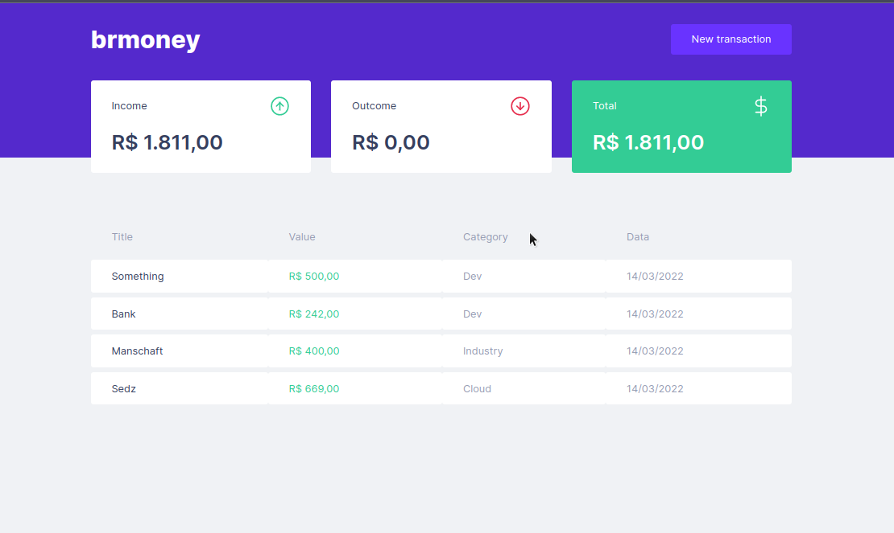

# brmoney

<p>
  
  
  <a href="https://opensource.org/licenses/MIT">
    
  </a>
  
</p>


## Tópicos 

[About brmoney](#about-brmoney)

[Technologies](#techonoliges)

[How to run](#how-to-run)

[Licence](#licence)

<br>

## About brmoney

The brmoney is a simple and effective alternative to manage your finances, allowing you to register entries, exits and organize them into categories.

<br>

<p align="center">
  
</p>

## Technologies

Technologies used:

- [React](https://reactjs.org/)
- [TypeScript](https://www.typescriptlang.org/)
- [Styled Components](https://styled-components.com/)
- [MirageJS](https://miragejs.com/)
- [Axios](https://github.com/axios/axios)
- [Polished](https://polished.js.org/)

<br>

## How to use

```bash
# Open the terminal and paste the follow command
git clone https://github.com/martins-rafael/dtmoney.git

# Open the past
cd dtmoney

# Install the dependencies
yarn install

# Run the app
yarn start
```

<br>


## Licence
<a href="https://opensource.org/licenses/MIT">
    
</a>

<br>

Esse projeto está sob a licença MIT. Veja o arquivo [LICENSE](/LICENSE) para mais detalhes.

---

Feito com :orange_heart: by [Breno Pereira](https://github.com/brcaua)

[](https://www.linkedin.com/in/rafaeldcmartins/) 
[](mailto:rafaeldcmartins@gmail.com)